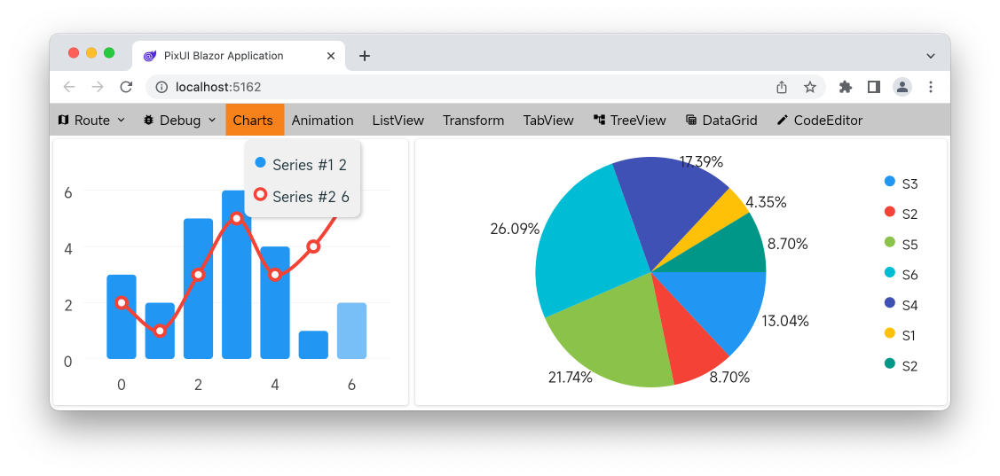

&emsp;&emsp;PixUI是一个跨端（桌面端、Web端、移动端）的UI框架，采用类似于Flutter的自绘引擎（Skia）绘制整个UI，保证各端的像素级一致性呈现。

# Widget Tree
每个界面都由组件树结构组成。有些组件为布局类的（eg: Column、Stack等），具备单或多子组件；有些组件为叶子节点(eg: Text、PieChart等)，通过设置相应的属性后直接绘制至画布。

```csharp
public class DemoView : View
{
    public DemoView()
    {
        Child = new Center
        {
            Child = new Column
            {
                Children =
                [
                    new Text("Hello World") { FontSize = 16 },
                    new Button("Click")
                ]
            }
        }
    }
}
```

# Widget State
可以定义状态变量并绑定至组件的相关属性，这样当状态值发生变更时，绑定的组件根据状态影响进行重新布局或仅重新绘制。

```csharp
public class DemoCounter : View 
{
    private readonly State<int> _counter = 0; //定义状态
    private readonly State<string> _display = _counter.ToComputed(c => c.ToString()); //计算状态
    
    public DemoCounter() 
    {
        Child = new Column
        {
            Children =
            {
                new Text(_display/*绑定至组件*/),
                new Button("+") { OnTap = e => _counter.Value+=1/*改变状态值*/ }
            }
        };
    }
}
```

# Animation
由AnimationController在指定时间段内驱动各Animation的动画值变化，从而连续改变组件的状态值。

```csharp
public class DemoAnimation : View
{
    private readonly AnimationController _controller;
    private readonly Animation<Offset> _offsetAnimation;
    
    public DemoAnimation()
    {
        _controller = new AnimationController(1000/*动画时长*/);
        _offsetAnimation = new OffsetTween(new Offset(-1, 0), new Offset(1, 0))
            .Animate(_controller); //位移变换并绑定至动画控制器
        
        Child = new Column
        {
            Children =
            {
                new Button("播放动画") { OnTap = e => _controller.Forward() },
                new SlideTransition(_offsetAnimation)
                {
                    Child = new Text("动画")
                }
            }
        };
    }
}
```